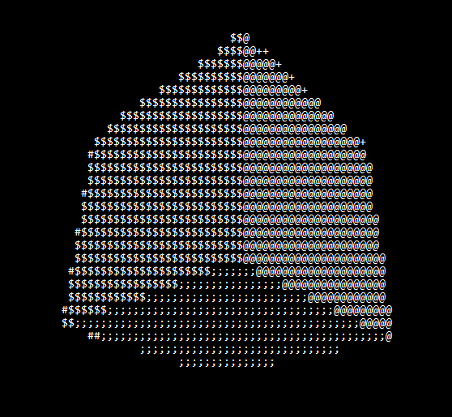

# cube.c

     

C algorithm that generates a spinning 3d cube in the terminal.

Big thanks to Andy Sloane (a1kon) for his [spinning donut code](https://cppsecrets.com/users/9748495049554948514955485251641031051169710946105110/The-Beautiful-C-Program-That-Creates-a-3D-Rotating-Donut.php) and for his [explanation](https://www.a1k0n.net/2011/07/20/donut-math.html).
Also, I couldn't have done it without [Servet Gulnaroglu's adaption](https://github.com/servetgulnaroglu/cube.c) and [video](https://www.youtube.com/watch?v=p09i_hoFdd0&t=268s).